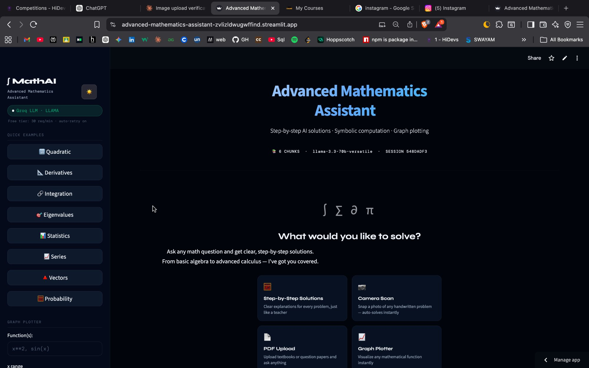
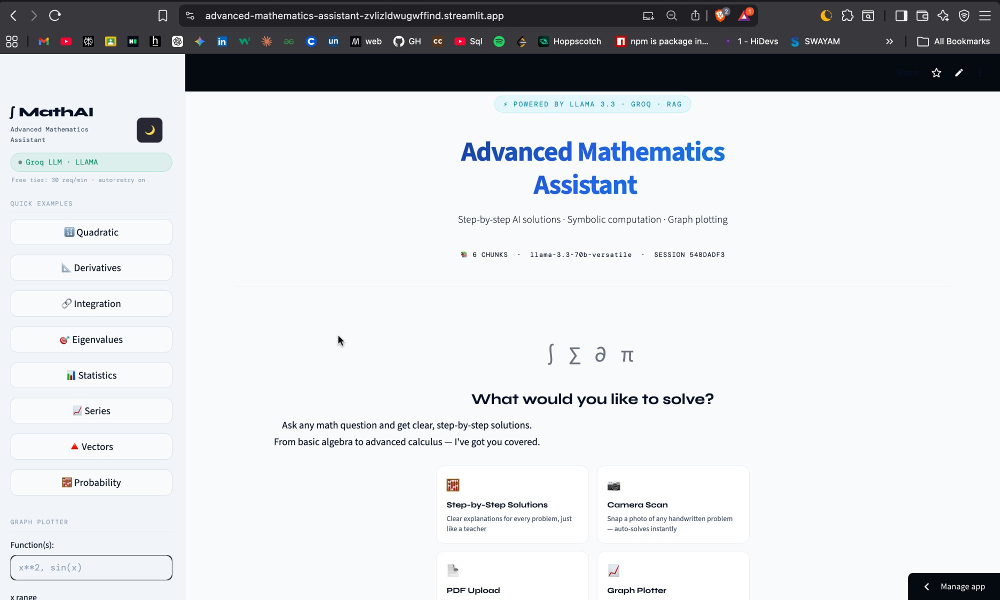

<div align="center">

# ∫ Advanced Mathematics Assistant

[](https://advanced-mathematics-assistant-zvlizldwugwffind.streamlit.app/)
[](https://python.org)
[](https://langchain.com)
[](https://groq.com)
[](https://ncert.nic.in)
[](https://jeeadv.ac.in)

**The most complete free AI math tutor for Indian students.**
**Class 6 → Class 12 → JEE Advanced. Zero missing chapters.**

[**🚀 Try Live Demo**](https://advanced-mathematics-assistant-zvlizldwugwffind.streamlit.app/) · [Report Bug](https://github.com/sarika-stack23/AdvMAthAI/issues) · [Request Feature](https://github.com/sarika-stack23/AdvMAthAI/issues)

</div>

---

## 📸 Screenshots

| Dark Mode | Light Mode |
|---|---|
|  |  |

---

## ✨ What's New in V2

### 🧠 Complete NCERT Knowledge Base (104 chapters, zero missing)

| Class | Chapters | Topics Covered |
|---|---|---|
| Class 6 | 14 | Numbers, Fractions, Geometry, Mensuration, Algebra |
| Class 7 | 15 | Integers, Equations, Triangles, Congruence, Exponents |
| Class 8 | 16 | Quadrilaterals, CI/SI, Identities, Factorisation |
| Class 9 | 15 | Irrationals, Polynomials, Circles, Heron's Formula |
| Class 10 | 15 | Real Numbers, Quadratics, Trigonometry, Statistics |
| Class 11 | 16 | Sets, Complex Numbers, P&C, Conics, Limits |
| Class 12 | 13 | Matrices, Integrals, Differential Equations, Vectors |
| JEE Advanced | 8 | L'Hopital, Theory of Equations, Cauchy-Schwarz, CRT |

### 📱 Class-wise Sidebar Browser
- Dropdown selector for all 8 class groups
- 112 chapter buttons — one click sends a sample question
- Works perfectly on mobile, tablet, iPad, desktop
- No more flat list of 8 hardcoded examples

### 📊 Knowledge Base Stats
- **118 RAG documents** (was 6 in V1)
- **3,500+ ChromaDB vector chunks** (was ~610)
- **Separate `knowledge_base.py`** — cleaner architecture, easier to extend
- Metadata filtering by class level, topic, difficulty

---

## ✨ All Features

- 🧮 **Step-by-step solutions** — NCERT/CBSE style, auto-detects difficulty (Class 6 to JEE Advanced)
- 📚 **Complete NCERT coverage** — every chapter from Class 6 to Class 12, nothing missing
- 🏆 **JEE Advanced level** — L'Hopital, Taylor series, Cauchy-Schwarz, Theory of Equations
- 📱 **Class-wise sidebar** — browse 112 chapters by class, one click to solve
- ⚡ **Symbolic computation** — exact derivatives, integrals, equation solving via SymPy
- 📈 **Graph plotter** — visualize any mathematical function instantly
- 📄 **PDF upload** — upload textbooks or question papers and ask anything
- 📷 **Camera / image scan** — snap a photo of a handwritten problem, auto-solves
- 💬 **Chat memory** — remembers conversation context (MongoDB or in-memory)
- 🌗 **Dark / light theme** — toggle in sidebar
- 🔄 **Auto model fallback** — if Groq daily limit hit, silently switches to backup model
- 🔒 **Secure** — no `eval()` on user input, all API keys via environment variables

---

## 🛠️ Tech Stack

| Layer | Technology |
|---|---|
| UI | Streamlit |
| LLM | Groq (llama-3.3-70b-versatile) |
| Embeddings | HuggingFace sentence-transformers/all-MiniLM-L6-v2 |
| Vector DB | ChromaDB (default) or FAISS |
| Knowledge Base | 118 NCERT documents (knowledge_base.py) |
| Symbolic Math | SymPy |
| OCR | Tesseract + pytesseract |
| Memory | MongoDB Atlas (optional) or in-memory |
| RAG Framework | LangChain |

---

## 📁 Project Structure

```
AdvMAthAI/
├── main.py               # UI + AI engine (7-step pipeline)
├── knowledge_base.py     # All 118 NCERT + JEE documents + sidebar data ← NEW in V2
├── .env                  # Your API keys (never commit this)
├── .env.example          # Template — safe to commit
├── .gitignore
├── requirements.txt      # Python dependencies
├── packages.txt          # System dependencies (tesseract)
├── README.md
├── screenshots/
│   ├── dark_mode.png
│   └── light_mode.png
├── chroma_db/            # Vector DB (auto-created, gitignored)
└── faiss_index/          # FAISS index (auto-created, gitignored)
```

---

## ⚙️ Local Setup

### Prerequisites

- Python 3.11+
- [Groq API key](https://console.groq.com) (free)

### 1. Clone the repo

```bash
git clone https://github.com/sarika-stack23/AdvMAthAI.git
cd AdvMAthAI
```

### 2. Create virtual environment

```bash
python3.11 -m venv venv
source venv/bin/activate        # Mac/Linux
venv\Scripts\activate           # Windows
```

### 3. Install dependencies

```bash
pip install -r requirements.txt
```

### 4. Install Tesseract (for camera scan)

```bash
# macOS
brew install tesseract

# Linux
sudo apt install tesseract-ocr

# Windows — download installer:
# https://github.com/UB-Mannheim/tesseract/wiki
```

### 5. Configure `.env`

```bash
cp .env.example .env
```

Edit `.env` and fill in your keys:

```env
GROQ_API_KEY=your_groq_api_key_here        # Free at console.groq.com
HUGGINGFACE_API_TOKEN=your_token_here      # Free at huggingface.co
MONGODB_URI=                               # Optional — leave empty for in-memory
```

### 6. Build knowledge base and run

```bash
# First time — build the vector database
python3.11 main.py --rebuild

# Launch the app
python3.11 -m streamlit run main.py
```

Open **http://localhost:8501** 🎉

---

## 🔑 Getting a Free Groq API Key

1. Go to [console.groq.com](https://console.groq.com)
2. Sign up (free)
3. Go to **API Keys** → **Create API Key**
4. Paste in `.env` as `GROQ_API_KEY=gsk_...`

**Free tier limits — app handles all of this automatically:**

| Model | Tokens/Day | Role |
|---|---|---|
| llama-3.3-70b-versatile | 100,000 | Primary (best quality) |
| llama3-8b-8192 | 500,000 | Fallback 1 (auto-switch) |
| mixtral-8x7b-32768 | 500,000 | Fallback 2 (auto-switch) |

---

## ☁️ Deploy to Streamlit Cloud

1. Push code to GitHub (both `main.py` and `knowledge_base.py`)
2. Go to [share.streamlit.io](https://share.streamlit.io) → **New app**
3. Select your repo → set main file to `main.py`
4. Go to **Settings → Secrets** and paste:

```toml
GROQ_API_KEY = "your_groq_api_key_here"
HUGGINGFACE_API_TOKEN = "your_token_here"
LLM_MODEL = "llama-3.3-70b-versatile"
EMBEDDING_MODEL = "sentence-transformers/all-MiniLM-L6-v2"
VECTOR_DB_TYPE = "chroma"
CHROMA_PERSIST_DIR = "./chroma_db"
FAISS_INDEX_PATH = "./faiss_index"
MONGODB_URI = ""
MONGODB_DB_NAME = "math_assistant"
MONGODB_COLLECTION = "chat_history"
CHUNK_SIZE = "1000"
CHUNK_OVERLAP = "200"
TOP_K_RESULTS = "5"
APP_TITLE = "Advanced Mathematics Assistant"
DEBUG = "False"
```

5. Click **Deploy** 🚀

---

## 🧪 CLI Commands

```bash
python3.11 -m streamlit run main.py   # Launch UI
python3.11 main.py --setup            # Build knowledge base
python3.11 main.py --rebuild          # Force rebuild knowledge base
python3.11 main.py --test             # Run unit tests
python3.11 main.py --eval             # Evaluate RAG pipeline
```

---

## 🐛 Troubleshooting

| Problem | Fix |
|---|---|
| No answer shown | Check Groq API key in `.env` or Streamlit Cloud Secrets |
| Daily token limit | App auto-switches model — just keep using it |
| ChromaDB error | Delete `chroma_db/` folder and run `--rebuild` |
| Slow first load | Normal — embedding model downloads once, then instant |
| knowledge_base import error | Make sure `knowledge_base.py` is in same folder as `main.py` |
| Meta tensor error on startup | Pinned versions in `requirements.txt` fix this |
| OCR / camera scan not working | Run `pip install pytesseract` then `brew install tesseract` (Mac) |
| Wrong image shows pytesseract error | Fixed in v1.2.1 — update to latest `requirements.txt` |
| Math symbols look broken (π, ∑) | Fixed in v1.2.0 — app uses plain Unicode, no LaTeX |
| App crashes on startup | Run with `python3.11 -m streamlit run main.py` |

---

## 📝 Changelog

### v2.0.0 — April 2026
- ✅ **Complete NCERT coverage** — 104 chapters from Class 6 to Class 12, zero missing
- ✅ **JEE Advanced** — 8 topic groups covering competition-level math
- ✅ **118 RAG documents** — 20x more knowledge than v1 (was 6 documents)
- ✅ **3,500+ ChromaDB chunks** — significantly improved retrieval accuracy
- ✅ **Separate `knowledge_base.py`** — cleaner architecture, easier to extend
- ✅ **Class-wise sidebar** — `st.selectbox` dropdown for all 8 class groups, 112 chapter buttons
- ✅ **Mobile-first sidebar** — works perfectly on Android, iPhone, iPad, tablet, desktop
- ✅ **Metadata-rich documents** — each document tagged with class_level, chapter, topic, difficulty

### v1.2.1 — March 2026
- ✅ Added `pytesseract>=0.3.10` to `requirements.txt`
- ✅ Wrong image now correctly shows "❌ This is not a Math image" card
- ✅ Added real dark/light mode screenshots to README

### v1.2.0 — March 2026
- ✅ Fixed OCR logic — wrong image no longer shows pytesseract install error
- ✅ Fixed tesseract binary path for macOS Apple Silicon
- ✅ OS-tabbed install instructions (macOS / Linux / Windows) in sidebar
- ✅ Replaced broken LaTeX with clean Unicode
- ✅ Pinned `sentence-transformers==2.7.0` + `transformers==4.40.2`
- ✅ Added `numpy<2.0.0` pin

### v1.1.0 — March 2026
- ✅ Auto model fallback (70B → 8B → Mixtral) on daily token limit
- ✅ Streamlit Cloud secrets support
- ✅ Fixed widget key bug
- ✅ Fixed LangChain template crash on math content with `{ }` braces
- ✅ Module-level caching for embeddings, LLM, pipeline

### v1.0.0 — Initial Release
- 🎉 Full RAG pipeline with ChromaDB / FAISS
- 🎉 Streamlit UI with dark/light theme
- 🎉 Symbolic math via SymPy
- 🎉 PDF upload, camera scan, graph plotter
- 🎉 MongoDB chat memory

---

## 🤝 Contributing

Contributions are welcome!

1. Fork the repo
2. Create a branch: `git checkout -b fix/your-fix`
3. Commit: `git commit -m "fix: description"`
4. Push: `git push origin fix/your-fix`
5. Open a Pull Request

---

## 📄 License

MIT License — free to use, modify, and distribute.

---

<div align="center">
  Made with ❤️ by <strong>Sarika</strong>
  <br><br>
  <a href="https://advanced-mathematics-assistant-zvlizldwugwffind.streamlit.app/">🚀 Live Demo</a> &nbsp;·&nbsp;
  <a href="https://github.com/sarika-stack23/AdvMAthAI/issues">🐛 Report Bug</a> &nbsp;·&nbsp;
  <a href="https://github.com/sarika-stack23/AdvMAthAI/issues">💡 Request Feature</a>
</div>